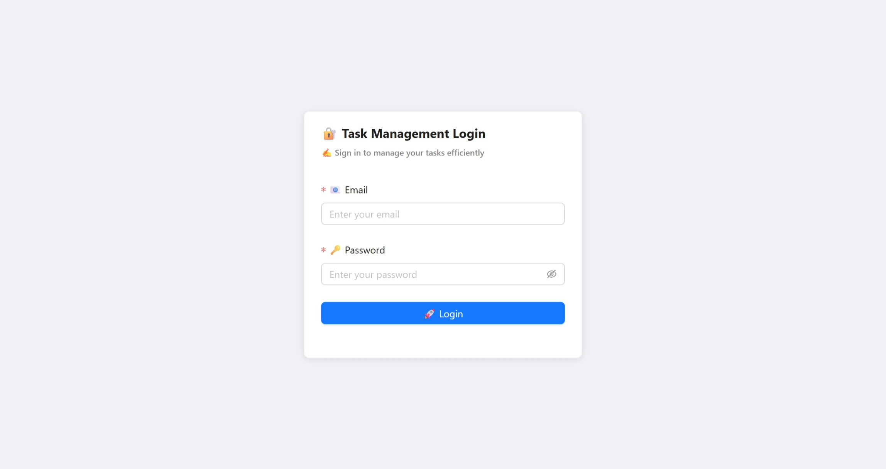
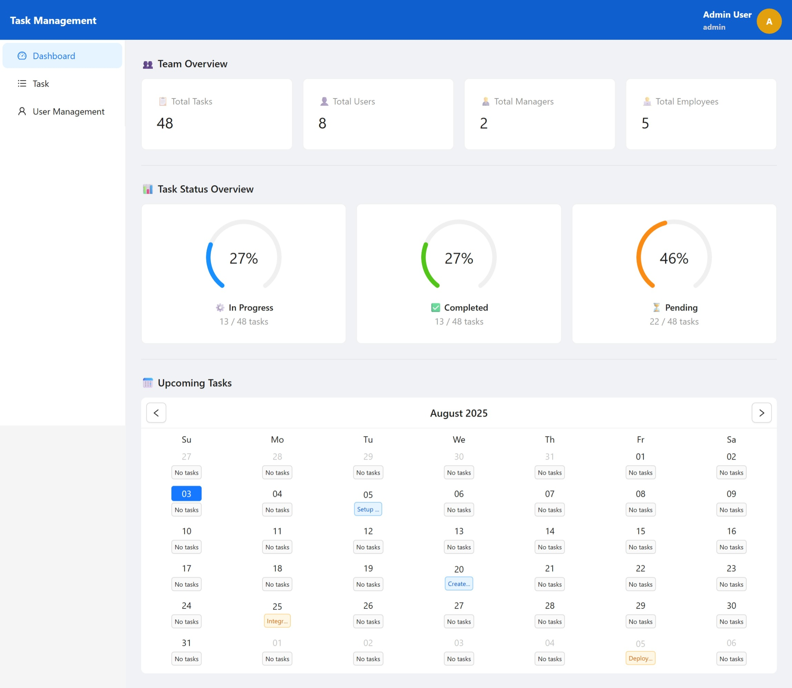
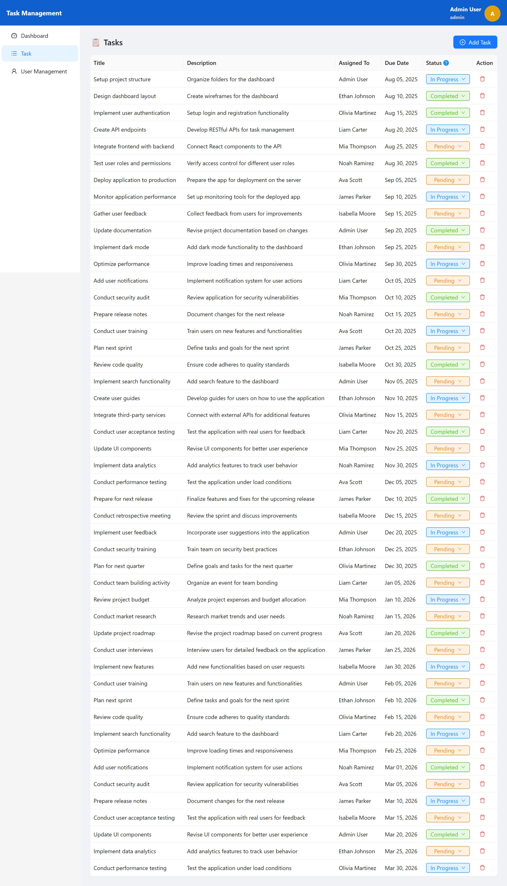
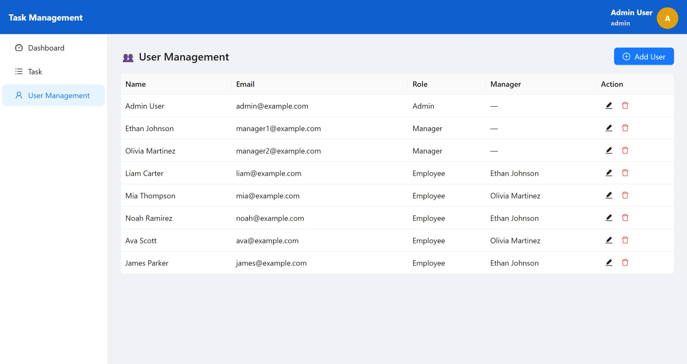

# 📋 Task Management App

A modern, responsive **Task Management Web Application** built with **React** and **Ant Design**.
It helps teams **create, assign, and track tasks** with role-based dashboards for **Admins, Managers, and Employees**.

---

## ✨ Features

- 🔐 **Role-based access**: Admin, Manager, and Employee views
- 📊 **Dashboard**: Task statistics, team overview, and upcoming tasks calendar
- ➕ **Task creation**: Create and assign tasks with due dates
- 📅 **Calendar integration**: View tasks by date
- 👥 **Team management**: View and manage team members
- 📱 **Responsive design**: Works seamlessly on desktop, tablet, and mobile
- 🎨 **Ant Design UI** with custom theming and emoji-friendly labels

---

## 🖥️ Tech Stack

- **Frontend**: [React + Vite](https://vite.dev/guide/) + [Ant Design](https://ant.design/)
- **State Management**: Redux Toolkit
- **Date Handling**: Day.js
- **Icons**: Ant Design Icons
- **API Layer**: Axios-based service wrapper
- **Styling**: SCSS Modules
- **Mock Server**: JSON - server
- **Node version**: v22.16.0

---

## 📂 Folder Structure

```
src/
├── components/       # Reusable components (Loader, PageSpin, etc.)
├── common/           # Constants and helper functions
├── context/          # Context API hooks (Message API, etc.)
├── Layout/           # Layout setup
├── pages/            # Feature pages (Dashboard, Task, Login)
├── routes/           # Application routing
├── server/           # Mock API server
├── store/            # Redux slices and store configuration
├── utils/            # API service handlers
└── main.js           # Main app component
```

---

## ⚙️ Installation

### 1️⃣ Clone the Repository

```bash
git clone https://github.com/kiranbalaji71/task-management-app.git
cd task-management-app
```

### 2️⃣ Install Dependencies

```bash
npm install
```

### 3️⃣ Start the Development Server

- **first run the mock API server**

```cmd
npm run server
```

- **then run the react app**

```cmd
npm run dev
```

---

## 🔑 Roles & Permissions

| Role         | Permissions                                                       |
| ------------ | ----------------------------------------------------------------- |
| **Admin**    | Create/edit/delete tasks, manage users & managers, view all stats |
| **Manager**  | Create/edit/delete tasks for their team, view team stats          |
| **Employee** | View & update assigned tasks                                      |

---

## 🔑 Credentials

| Role         | Email                | Password   |
| ------------ | -------------------- | ---------- |
| **Admin**    | admin@example.com    | admin123   |
| **Manager**  | manager1@example.com | manager123 |
| **Employee** | liam@example.com     | emp123     |

---

## 🖼️ Screenshots

### Login Page



### Dashboard Page



### Task Page



### User Page



---

## 💡 Author

**Kiran Balaji**
📧 [kiran19701@gmail.com](mailto:kiran19701@gmail.com)
🔗 [LinkedIn](https://www.linkedin.com/in/kiran-balaji/)
